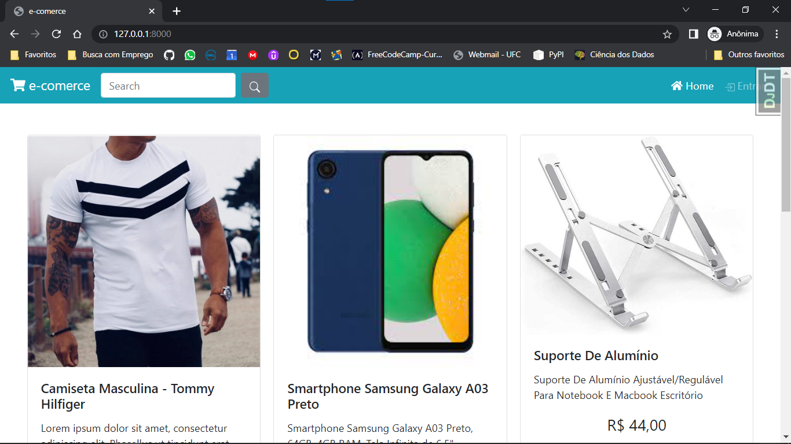
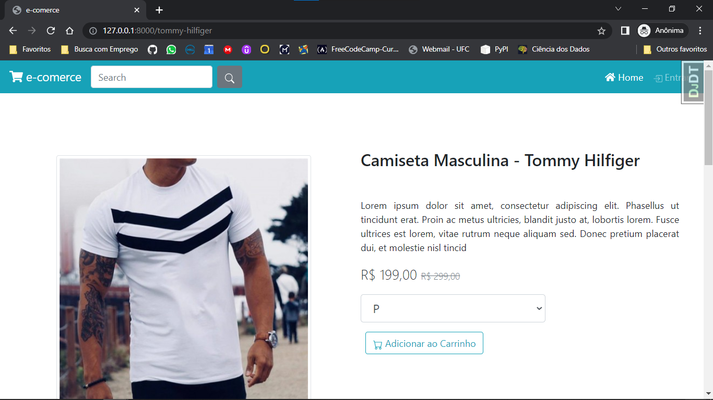
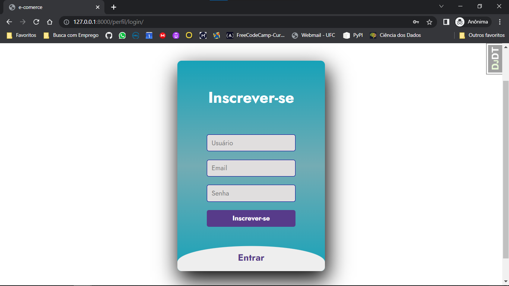
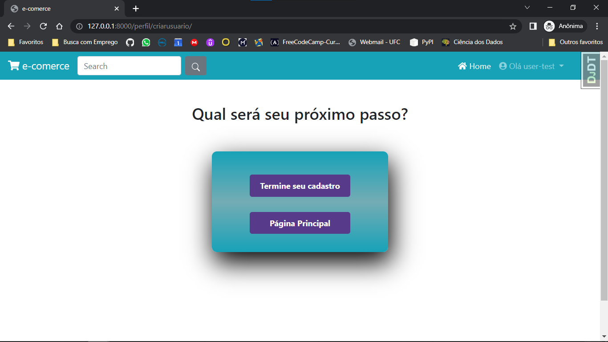
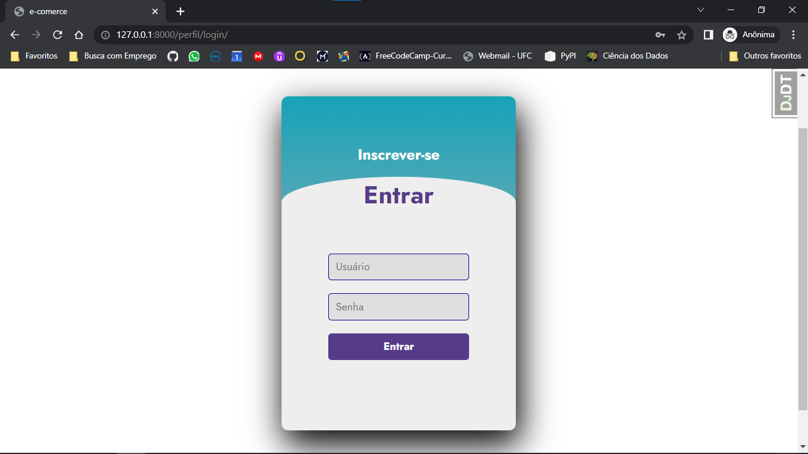

# Modelo de E-comerce_Django


## Apresentação

Este é um projeto voltado para estudo em Python e em seu framework para desenvolvimento Web, Django. É um projeto multidisciplinar na área de computação, em que pra desenvolvê-lo foi necessário desenvolver não só em Python mas também em HTML, CSS e até arranhar um pouco em JavaScript e Bootstrap. 
Como este projeto está sendo desenvolvido em single-core, ele ainda está bem no início em que muitas funcionalidades ainda estão em processo de desenvolvimento desenvolvimento. Então, qualquer ajuda e qualquer sugestão é bem vinda. 

## Ferramentas Utilizadas

Este projeto foi desenvolvido utilizando as seguintes ferramentas:

* Python 3.9
* Django 4.1
* Django-Crispy-Forms 1.4
* Pillow 9.2
* HTML
* CSS
* JavaScript
* Bootstrap
* SQLite3

## Rodando o Projeto na sua máquina

### Clonando o Repositório
Primeiramente você precisa fazer o clone do repositório utilizando o comando abaixo:

```
git clone https://github.com/leonhardc/e-comerce_Django.git
```

### Criando e instalando o ambiente virual
O projeto inteiro está sendo desenvolvido usando ambientes virtuais, se ainda não sabe ou não lembra como instalar um ambiente virtual python na sua máquina, basta executar o comando abaixo no seu terminal:

```
python -m venv venv
```

Depois de instalado, basta digitar `venv\Scrips\activate` no terminal do seu Windows, ou `source bin/activate` no linux.

### Instalando as dependencias do projeto

Depois que o projeto foi clonado e seu ambiente virtual está devidamente instalado e ativado, temos agora que instalar as dependencias do projeto, antes que possamos de fato, testá-lo:

Para instalar as dependencias do projeto, basta o comando abaixo no terminal:

```
pip install -r requirements.txt
```

### Executando e testando o projeto

Vamos lá, só mais um pouco para chegarmos onde queremos. Depois de todos os passos anteriores e lembrando, com o ambiente virtual ativado, só precisamos rodar o servidor nativo do django, para que ele cuide das nossas requisições e faça a aplicação, de fato, ser executada. 

Execute no seu terminal o comando para que possamos ativar o servidor django:

```
python manage.py runserver
```

Depois de alguns momentos, se todos os passos anteriores foram executados corretamente, podemos ver na tela do terminal algo como:


```
Watching for file changes with StatReloader
Performing system checks...

System check identified no issues (0 silenced).
September 27, 2022 - 20:54:37
Django version 4.1, using settings 'loja.settings'
Starting development server at http://127.0.0.1:8000/
Quit the server with CTRL-BREAK.
```

Se a mensagem acima foi exibida, então você pode acessar e ver a aplicação em execução digitando na barra de endereço do seu navegador o IP `http://127.0.0.1:8000/`


Como o projeto, a início não usa de base de dados mais robustas, fique a vontade para fazer seu cadastro, entrar entrar e bricar um pouco no pouco que já foi implementado.


## Um pouco da cara inicial do projeto

### Página Inicial

Abaixo é mostrado como o projeto se mostra inicialmente, com uma navbar simples com 4 elementos: a logo do projeto, um pequeno formulário de pesquisa de produtos (ainda não funcional), um botão para página principal do app e um botão entrar. Logo abaixo da navbar temos uma area direcionada para exibir os cards de todos os produtos cadastrados no banco de dados do nosso app.

Acrescento que as imagens usadas no projeto são meramente ilustrativas e não tem o intuito de fechar compra, até porque qualquer imagem contida no projeto foi retirada de outros sites reais de e-comerce e estão aqui simplesmente para compor cenário.



## Página de detalhes do produto

Se clicármos em qualquer cards de algum produto, seremos redirecionados para a página a seguir. Esta página consta com alguns detalhes do produto, como nome, descrição curta e descrição longa sobre o produto e preço. Logo abaixo encontramos uma seção de comentários/avaliações do produto, que será implementada posteriormente. Essa página também consta com um formulário de escolha de variações e produto e um botão que adicionará o produto no carrinho de compras.



## Página de Login/Cadastro

Esta página é um pouco especial, é aqui onde o cliente irá realizar seu cadastro inicial ou logar com suas credencias preenchendo um dos dois formulários disponiveis, o formulario de cadastro ou o formulário de login. 

### Formulário de Cadastro

O formulário abaixo pede três informações ao usuário, nome de usuário, email e senha. É aqui onde o app irá criar as primeiras credenciais do usuário. Vale acrescentar que usamos o modelo de autenticação do django para facilitar a vida, ou seja, utilizamos model models.User do modulo django.contrib.auth. [Clique aqui para ver a documentação](https://docs.djangoproject.com/en/4.1/ref/contrib/auth/)



#### E agora?
O app oferece a possibilidade de termminármos o nosso cadastro ou seguirmos para página inicial e terminármos o cadastro depois.



### Formulário de Login

Para o caso do usuário não ser novo na plataforma e já ter suas credenciais devidamente cadastradas o proximo formulário serve para fazer login no app, fornecendo usuário e senha.




## Referências

* [Documentação Django](https://docs.djangoproject.com/pt-br/4.1/)
* [Bootstrap](https://getbootstrap.com/)
* [Certificação de Web Design Responsivo - Free Code Camp](https://www.freecodecamp.org/learn/2022/responsive-web-design/)


